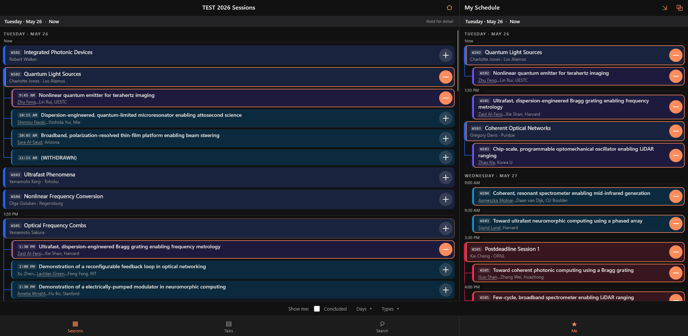
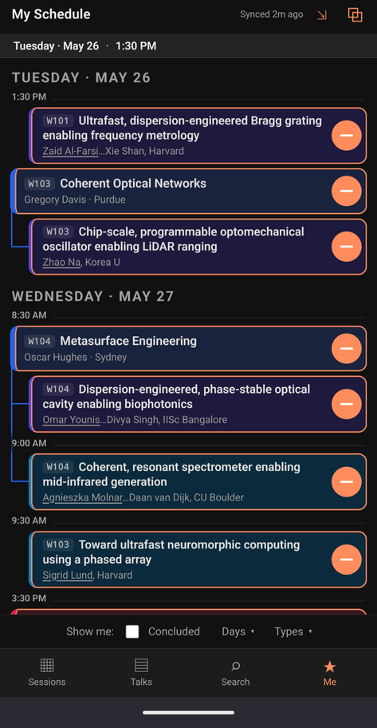

# The Fine Conference App

The Fine Conference App is a lightweight planner that replaces the clunky apps conferences foist on attendees. It's a single webpage, with nothing to install, no account, no notifications, and no splash screen. Your schedule lives in your browser, syncs across your devices, and works flawlessly on both your phone and computer. See it in action [here](https://htmlpreview.github.io/?https://github.com/burghoff/fine_conference_app/blob/main/conferences/test2026/test2026_app.html)! 

<table>
  <tr>
    <td align="center"></td>
    <td align="center"></td>
  </tr>
  <tr>
    <td align="center">Desktop view</td>
    <td align="center">Mobile view</td>
  </tr>
</table>

## Why

Conference organizers often ship a large app that requires an install, an account, and a network connection just to browse a program you could read on a single modern page. The Fine Conference App takes program data you have access to and turns it into one self-contained HTML file. Open it in any browser, and you have the whole conference. If you are organizing a conference, you can just host the page yourself and give your attendees a clean user experience at no cost to you.

## Features

- **One file, no install.** The build step produces a single `conference_app.html` with everything inlined. There are no external scripts, fonts, or network calls, so it loads instantly and works fully offline.
- **Build your own schedule.** Add any session or talk to a personal *My Schedule* view, and attach notes to individual talks.
- **Browse and search.** Separate tabs list every session and every talk, with full-text search across titles, authors, affiliations, and abstracts.
- **Filter the program.** Narrow what you see by day, by session/talk type, and hide concluded items so only what's still ahead remains.
- **Local storage that syncs.** Your schedule, notes, and preferences are saved in the browser's local storage so they persist between visits on that device. To sync them to another computer or phone, copy a sync code from one device and paste it into another.
- **Mobile and desktop layouts.** On phones, the four tabs (Sessions, Talks, Search, Me) sit in a bottom bar. On wide screens, Me becomes a permanent, resizable side pane next to the program.

## Usage

If your conference already has a subdirectory in `conferences/`, building its app requires just a single command from the root directory:

```bash
python scripts/make_app.py <conference_name>
```

That's all that's needed for any conference that's already set up. The command will download any needed program files and put them in `data/` (if needed), run the processor to produce `conference_data.json`, and run the builder to produce the HTML app.

Once built, `<conference_name>_app.html` is the whole app. Open it directly in a browser, host it anywhere as a static file, or (if you're an organizer) send it to attendees. There's nothing else to deploy.

If your conference does **not** yet have a subdirectory, it will need to be set up first. See [Curation: Adding a new conference](#curation-adding-a-new-conference) below.

## Curation: Adding a new conference

If your conference doesn't have a subdirectory yet, you will need to create one. This is called curation, and you are credited for curating the conference in the generated app.

A curated conference consists of two scripts:

1. **A downloader** (`fetch_program_<conf>.py`) that retrieves program data
2. **A processor** (`process_program_<conf>.py`) that turns it into a format the app can read

Once curation is complete, anyone with access to program data can use the downloader and processor to generate the app. If you would like to use AI to assist with curation, an AGENTS.md file is available. 

### Downloader

The downloader is responsible for getting the conference's raw source material onto disk and saving it into the subdirectory's `data/` directory. This is the only part of the pipeline that should touch the network.

A downloader can use whatever approach fits your conference's source, or users can download program files themselves manually. The required input files should always be saved in `data/`.

### Processor

The processor reads those raw files entirely offline and produces a single `conference_data.json` matching the schema documented in [`docs/CONFERENCE_JSON.md`](docs/CONFERENCE_JSON.md). That schema is source-agnostic, so completely different conferences with completely different processors can emit the same structure and use the same builder. This is also where conference-specific cleanup and enrichment happens, including things like:

- Recovering full author and speaker names
- Classifying session and talk types
- Attaching presiders and metadata
- Normalizing affiliations

## Requirements

- Python 3 for the build pipeline.
- A modern web browser to open the built app. No runtime, server, or account is required.

## License and Copyright

The Fine Conference App is MIT-licensed. This repository contains only code, but the program material a downloader fetches may be copyrighted by the conference and its publisher. Do not commit those files (or a built `conference_app.html`, which embeds them) to a public repository or otherwise redistribute them. If you plan to share a built app with attendees, make sure you have the right to distribute the underlying program data.

The Fine Conference App is intended as a user-side tool for organizing and viewing conference schedules and related metadata. Like Zotero, the software processes information already accessible to the user and generates a local/self-contained conference viewer. Users are responsible for ensuring their use complies with applicable conference policies, website terms, and copyright law.

Conference names, logos, trademarks, and program content are the property of their respective owners and are used only for identification and compatibility purposes. Unless explicitly stated, this project is not affiliated with or endorsed by any conference organizer, publisher, sponsor, or society.
